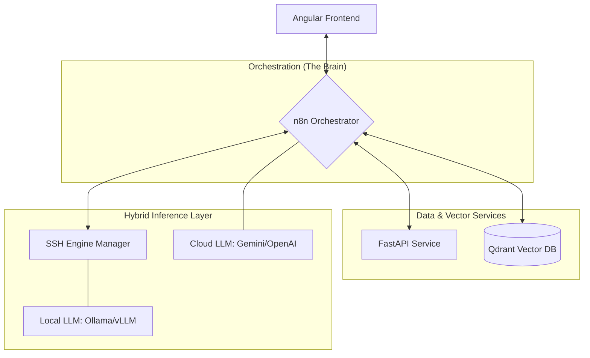
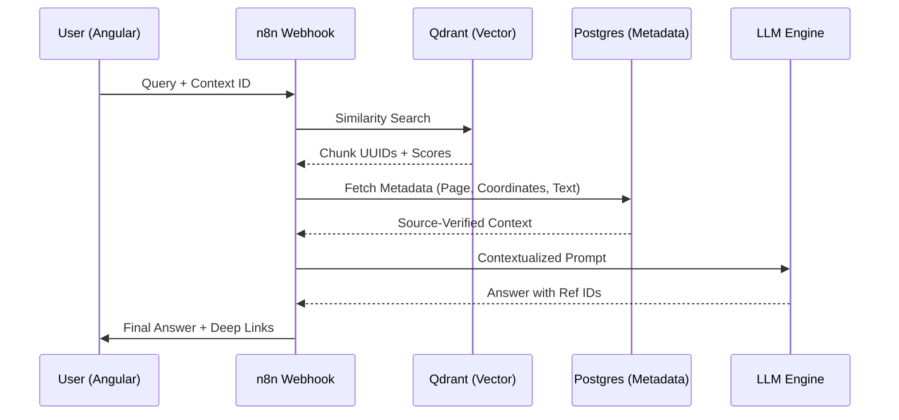

# 🚀 DistriRAG Framework
### Distributed, Agnostic, and Deterministic RAG Architecture

---

## 📋 1. Executive Summary

**DistriRAG** is a high-performance **RAG (Retrieval-Augmented Generation)** ecosystem designed for enterprise-grade scalability and strict data privacy. By decoupling the ingestion, vector indexing, and inference layers, it provides a unique **"Hybrid-Edge"** approach where data stays secure and compute remains flexible.

---

## 🏗️ 2. Technical Architecture & Stack

- **🧠 Orchestration Layer (The Brain):**  
  **n8n** manages the complex logic flow, acting as a stateless API Gateway and infrastructure controller.

- **💾 Data Consistency Layer:**  
  **Postgres 16** manages relational metadata and system state, ensuring 1:1 synchronization with the vector store.

- **🔍 Vector Engine:**  
  **Qdrant** provides high-speed HNSW indexing for semantic retrieval.

- **⚙️ Service Layer:**  
  **FastAPI (Python)** handles heavy lifting like PDF coordinate extraction, embedding generation, and semantic reranking.

- **🛡️ Application Layer:**  
  **NestJS** provides a robust backend for user management and system configuration.

- **🎨 Presentation Layer:**  
  **Angular** offers a specialized UI featuring "Point-and-Click" source verification.

---

## 💡 3. Key Innovation: Deterministic Source Traceability

Most RAG systems suffer from "hallucinated references." **DistriRAG** solves this by:

1. **Extracting exact bounding box coordinates** during PDF ingestion.
2. **Mapping unique Chunk-UUIDs** across Postgres and Qdrant.
3. **Allowing the user to click** an AI-generated citation and instantly open the source document at the exact page and paragraph.

---

## 🌐 4. Hybrid-Edge Operations (SSH Orchestration)

Through a custom **SSH2-based node in n8n**, the system can:

- **Provision and manage** remote inference engines (Ollama/vLLM) on edge GPU nodes.
- **Separate** the sensitive data layer from the high-compute inference layer.
- **Switch dynamically** between Cloud providers (Google Vertex AI, OpenAI) and local hardware based on cost or privacy requirements.

---

## 🚢 5. Deployment Strategy

The entire stack is **containerized using Docker Compose**, supporting multi-node deployment. Each microservice is independently scalable, allowing for high-availability configurations in production environments.
