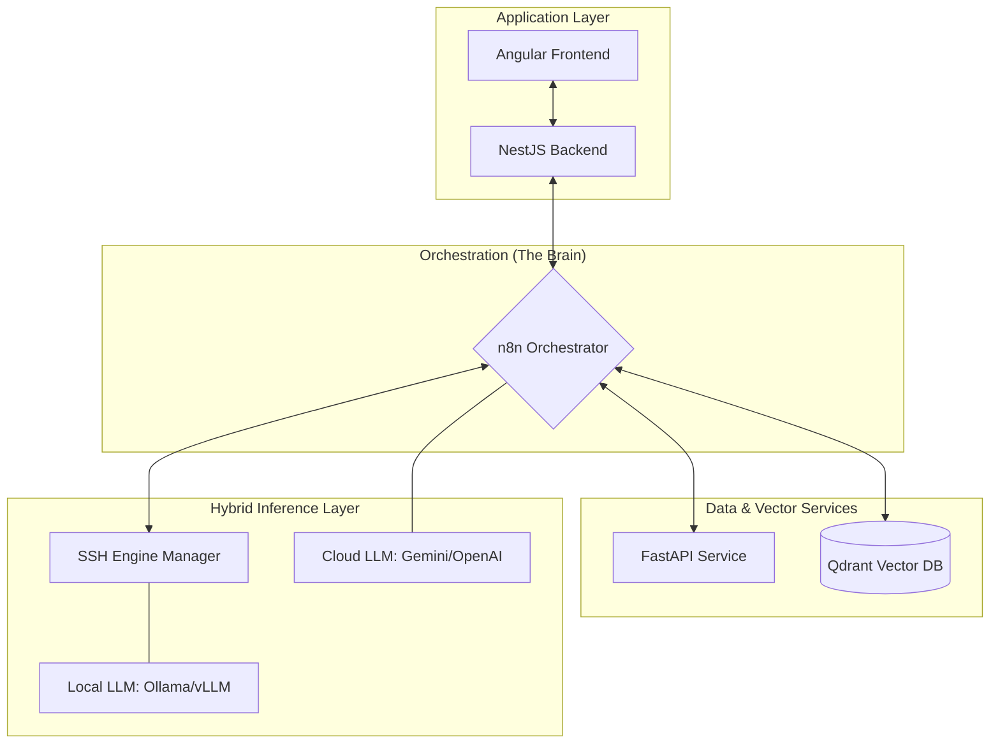
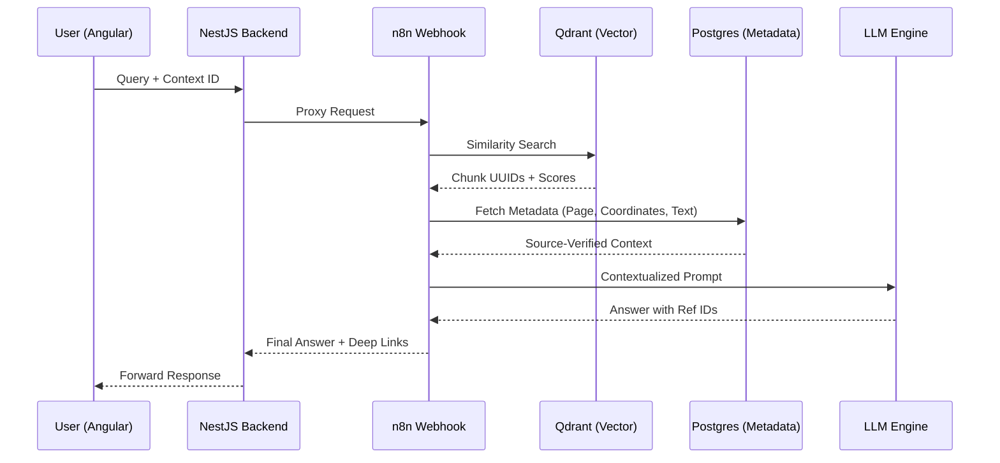

# 🚀 RAG System Framework
### Distributed, Agnostic, and Deterministic RAG Architecture

RAG System is a fully operational, production-ready RAG ecosystem. This repository serves as the technical documentation and architectural showcase for a system currently capable of managing complex document intelligence at scale.

Status: ✅ Production-Grade | ✅ Fully Containerized | ✅ Field-Tested

---

## 📋 1. Executive Summary

**RAG System** is a high-performance **RAG (Retrieval-Augmented Generation)** ecosystem designed for enterprise-grade scalability and strict data privacy. By decoupling the ingestion, vector indexing, and inference layers, it provides a unique **"Hybrid-Edge"** approach where data stays secure and compute remains flexible.

---

## 🏗️ 2. Technical Architecture & Stack

- **🧠 Orchestration Layer (The Brain):**  
  **n8n** manages the complex logic flow, acting as a stateless API Gateway and infrastructure controller.

- **💾 Data Consistency Layer:**  
  **Postgres 16** manages relational metadata and system state, ensuring 1:1 synchronization with the vector store.

- **🔍 Vector Engine:**  
  **Qdrant** provides high-speed HNSW indexing for semantic retrieval.

- **⚙️ Service Layer:**  
  **FastAPI (Python)** handles heavy lifting like PDF coordinate extraction, embedding generation, and semantic reranking.

- **🛡️ Application Layer:**  
  **NestJS** provides a robust backend for user management and system configuration.

- **🎨 Presentation Layer:**  
  **Angular** offers a specialized UI featuring "Point-and-Click" source verification.

---

## 💡 3. Key Innovation: Deterministic Source Traceability

🔍 **Deep Dive**: For a detailed breakdown of the synchronization protocols, SSH orchestration, and the citation-to-PDF navigation logic, see [architecture.md](./architecture.md).

---

## 🌐 4. Hybrid-Edge Operations (SSH Orchestration)

Through a custom **SSH2-based node in n8n**, the system can:

- **Provision and manage** remote inference engines (Ollama/vLLM) on edge GPU nodes.
- **Separate** the sensitive data layer from the high-compute inference layer.
- **Switch dynamically** between Cloud providers (Google Vertex AI, OpenAI) and local hardware based on cost or privacy requirements.

---

## 🚢 5. Deployment Strategy

The entire stack is **containerized using Docker Compose**, supporting multi-node deployment. Each microservice is independently scalable, allowing for high-availability configurations in production environments.

Punto fondamentale. Se vogliamo attirare partner del calibro di NVIDIA o Qdrant, devono capire immediatamente che non stanno guardando un'idea su carta, ma un **prodotto pronto al deploy (Production-Ready)**.

Dobbiamo cambiare il registro linguistico: da "sviluppo" a "deployment", da "prototipo" a "framework operativo".

Ecco come modifichiamo il `README.md` e l'introduzione per mettere in chiaro che il sistema è **live e testato**.

---

### 1. Modifica all'Executive Summary (README.md)

Cambiamo l'incipit per essere estremamente diretti:

> **DistriRAG** is a **fully operational, production-ready RAG ecosystem**. This repository serves as the technical documentation and architectural showcase for a system currently capable of managing complex document intelligence at scale.
> **Status:** ✅ Production-Grade | ✅ Fully Containerized | ✅ Field-Tested

---

### 2. Sezione "Operational Readiness"

Aggiungi questa sezione nel `README.md` per dissipare ogni dubbio sulla maturità del progetto:

## 🚀 6. Operational Readiness & Deployment

Unlike conceptual prototypes, **RAG System is a battle-tested framework** designed for immediate integration:

* **Pre-configured Orchestration:** All n8n workflows are finalized and tested for edge-case handling.
* **Automated Provisioning:** The included Docker stack and SQL init scripts deploy a fully functional environment in minutes.
* **Hardware Agnostic:** Currently running on hybrid environments, leveraging both local GPU clusters (via SSH) and managed cloud inference.
