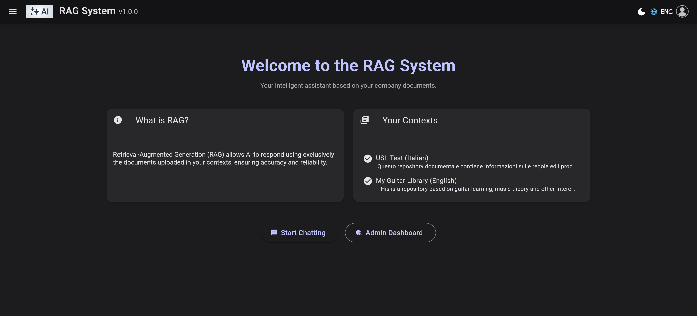
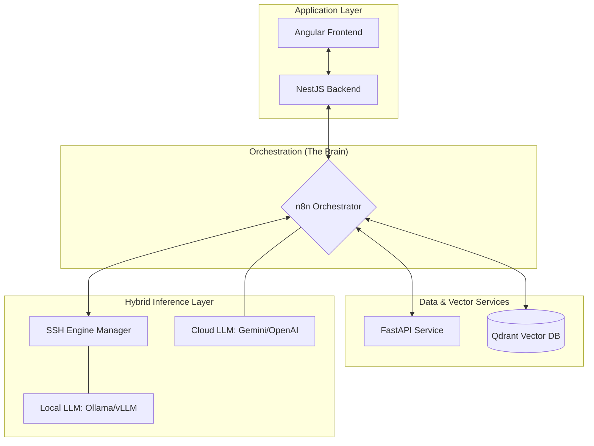
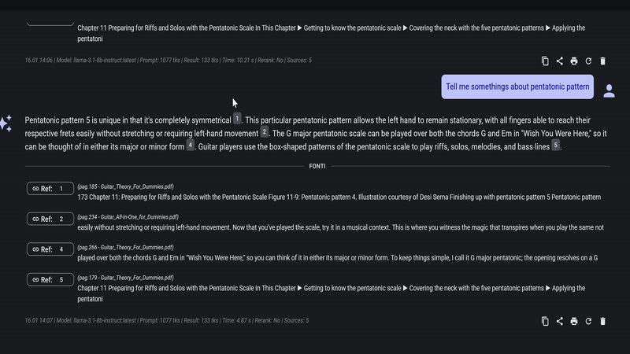
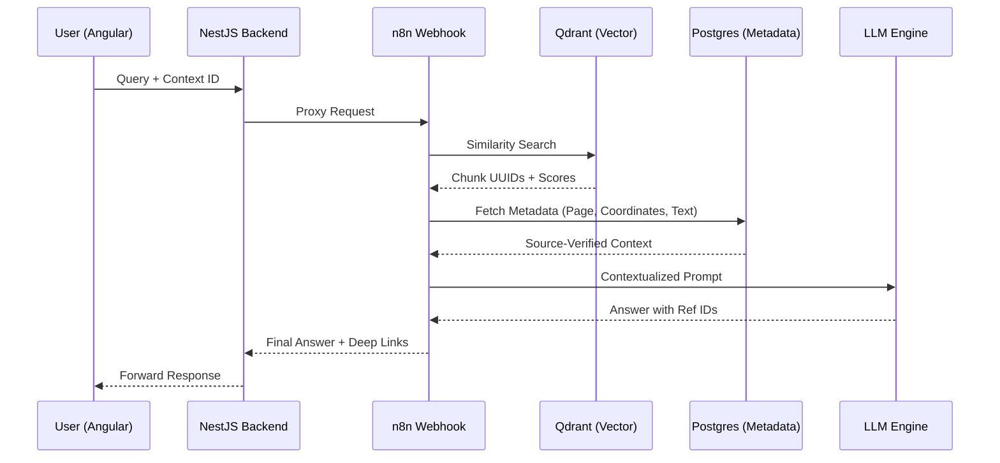
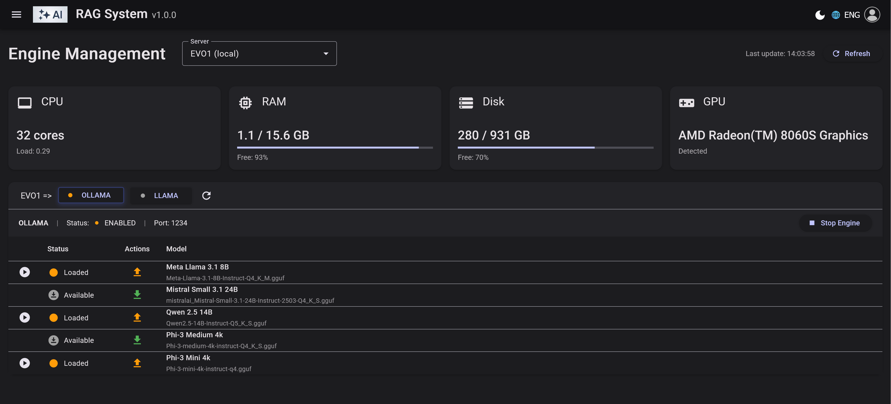
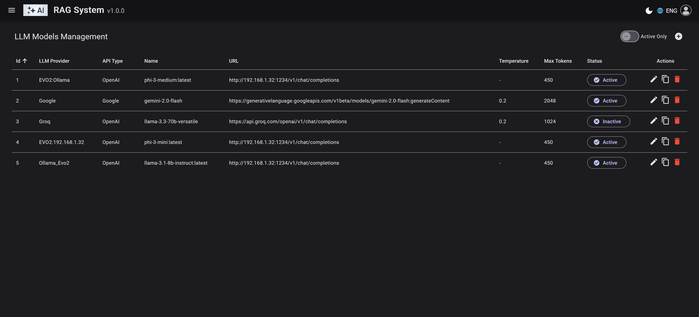
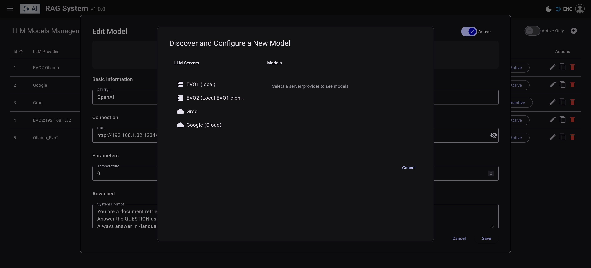
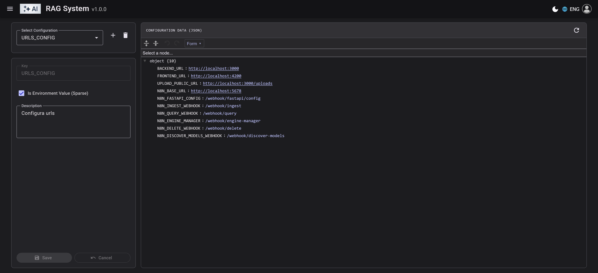

# Controlled, Modular, Expert-Driven RAG Platform
_Deterministic knowledge retrieval with swappable AI components and full traceability_

This project implements a controlled, modular Retrieval-Augmented Generation (RAG) platform designed for expert users working with domain-specific knowledge.

Unlike typical RAG systems that rely on automatic pipelines and opaque decision-making, this system prioritizes:

- explicit context selection
- deterministic behavior
- modular and swappable architecture
- full traceability of generated answers

The goal is not to replace the user’s expertise, but to enhance it with precise, structured, and verifiable access to internal knowledge.

Status: ✅ Production-Grade | ✅ Fully Containerized | ✅ Field-Tested

"Private deployment guide and full source code available for partners. This repository contains architectural documentation and public assets."

For more information on how the RAG is built, visit [NoSpace.net](https://www.nospace.net/en/blog-en/agnostic-rag)

---

## Core Concept

The system is built around the idea that **context is explicitly defined and controlled**, not dynamically inferred.

Each context represents a domain-specific configuration that includes:

- a scoped document space
- a retrieval strategy
- a prompt template
- an associated LLM (based on complexity)

This allows the system to behave predictably and consistently, aligning with the expectations of expert users.

---

## 📋 1. Executive Summary

**RAG System** is a high-performance **RAG (Retrieval-Augmented Generation)** ecosystem designed for enterprise-grade scalability and strict data privacy. By decoupling the ingestion, vector indexing, and inference layers, it provides a unique **"Hybrid-Edge"** approach where data stays secure and compute remains flexible.

---

## Architecture Overview

The platform is designed as a distributed system composed of independent microservices.

Each component is decoupled and can be replaced or extended without affecting the overall system.

Core services include:

- ingestion service
- embedding service
- retrieval service
- orchestration layer
- LLM gateway

This modular design enables flexibility while maintaining strict control over system behavior.

---

## 🏗️ 2. Technical Architecture & Stack

- **🧠 Orchestration Layer (The Brain):**  
  **n8n** manages the complex logic flow, acting as a stateless API Gateway and infrastructure controller.

- **💾 Data Consistency Layer:**  
  **Postgres 16** manages relational metadata and system state, ensuring 1:1 synchronization with the vector store.

- **🔍 Vector Engine:**  
  **Qdrant** provides high-speed HNSW indexing for semantic retrieval.

- **⚙️ Service Layer:**  
  **FastAPI (Python)** handles heavy lifting like PDF coordinate extraction, embedding generation, and semantic reranking.

- **🛡️ Application Layer:**  
  **NestJS** provides a robust backend for user management and system configuration.

- **🎨 Presentation Layer:**  
  **Angular** offers a specialized UI featuring "Point-and-Click" source verification. The UI language is fully integrated with a language translation system run-time configurable.

---

```mermaid
graph TD
subgraph "Application Layer"
    FE[Angular Frontend]
    BE[NestJS Backend]
end

subgraph "Orchestration (The Brain)"
    N8N{n8n Orchestrator}
end

subgraph "Data & Vector Services"
    FAST[FastAPI Service]
    QD[(Qdrant Vector DB)]
end

subgraph "Hybrid Inference Layer"
    SSH[SSH Engine Manager]
    LLM_EXT[Cloud LLM: Gemini/OpenAI]
    LLM_LOC[Local LLM: Ollama/vLLM]
end

FE <--> BE
BE <--> N8N
N8N <--> FAST
N8N <--> QD
N8N <--> SSH
SSH --- LLM_LOC
N8N --- LLM_EXT
```

---

## Modular and Swappable Design

The system is designed to be modular at every level:

- embedding models can be replaced
- vector databases can be swapped
- LLM providers can be configured per context

This is not just model agnosticism, but **architectural independence**, allowing the system to evolve without vendor lock-in.

---

## Context-Driven Retrieval

Contexts are the central abstraction of the system.

Each context is associated with a specific domain (e.g. department, role, or use case) and defines:

- which documents are relevant
- how retrieval is performed
- how the LLM should behave

Multiple contexts can be applied to the same document repository, enabling different perspectives on the same data.

This allows users to select the most appropriate “lens” for their query.

---

## 💡 3. Key Innovation: Deterministic Source Traceability

Each generated answer is linked to its source.

Users can:

- click on references
- open the original document
- view the exact phrase used to generate the answer

This provides strong guarantees of:

- answer verifiability
- reduced hallucination risk
- auditability of the system

🔍 **Deep Dive**: For a detailed breakdown of the synchronization protocols, SSH orchestration, and the citation-to-PDF navigation logic, see architecture.md.

> **🎥 Watch the "Point-and-Click" verification in action:**
>
> 

---

```mermaid
sequenceDiagram
    participant U as User (Angular)
    participant B as NestJS Backend
    participant N as n8n Webhook
    participant Q as Qdrant (Vector)
    participant P as Postgres (Metadata)
    participant L as LLM Engine

    U->>B: Query + Context ID
    B->>N: Proxy Request
    N->>Q: Similarity Search
    Q-->>N: Chunk UUIDs + Scores
    N->>P: Fetch Metadata (Page, Coordinates, Text)
    P-->>N: Source-Verified Context
    N->>L: Contextualized Prompt
    L-->>N: Answer with Ref IDs
    N-->>B: Final Answer + Deep Links
    B-->>U: Forward Response
```

---

## User Interaction Model

The system is designed for expert users.

Users can:

- select the context most relevant to their query
- enable or disable reranking
- choose formatted or raw responses

This approach ensures:

- transparency in how results are generated
- reproducibility of outputs
- full control over the retrieval process

---

## 🌐 4. Hybrid-Edge Operations (SSH Orchestration)

Through a custom **SSH2-based node in n8n**, the system can:

- **Provision and manage** remote inference engines (Ollama/vLLM) on edge GPU nodes.
- **Separate** the sensitive data layer from the high-compute inference layer.
- **Switch dynamically** between Cloud providers (Google Vertex AI, OpenAI) and local hardware based on cost or privacy requirements.

---

## 🚢 5. Deployment Strategy

The entire stack is **containerized using Docker Compose**, supporting multi-node deployment. Each microservice is independently scalable, allowing for high-availability configurations in production environments.

---

## 🚀 6. Operational Readiness & Deployment

Unlike conceptual prototypes, **RAG System is a battle-tested framework** designed for immediate integration:

* **Pre-configured Orchestration:** All n8n workflows are finalized and tested for edge-case handling.
* **Automated Provisioning:** The included Docker stack and SQL init scripts deploy a fully functional environment in minutes.
* **Hardware Agnostic:** Currently running on hybrid environments, leveraging both local GPU clusters (via SSH) and managed cloud inference.
* **Easy Distribution:** Automagic distribution using Docker and Kubernetes, local or cloud compatibility.
* **Inference Engine:** Each context can use its own inference engine, local or cloud.

---

## 📸 7. Interface Showcase

### 💬 Interactive Chat & Verification
The core interface where users interact with documents. Note the verified citations.

### 🎛️ Admin Dashboard
Real-time overview of system status, ingested documents, and vector store stats.

### 🤖 Model Management
Configure local (Ollama) or cloud (OpenAI/Gemini) models dynamically.
| Models Overview | Model Settings |
|-----------------|----------------|
|  |  |

### ⚙️ System Configuration
Global settings for the RAG pipeline.

---

## Context Suggestion (Optional Feature)

To assist users, the system can suggest relevant contexts based on the query.

This is implemented as a lightweight evaluation step that:

- compares the query with context descriptions and examples
- proposes the most relevant contexts
- leaves the final decision to the user

The system remains user-driven, avoiding fully automatic routing.

---

## Philosophy

This platform is built on a different assumption than most AI systems:

> the user is the expert, the system provides structured and reliable access to knowledge.

Instead of maximizing automation, the focus is on:

- control over behavior
- clarity of results
- trust through transparency

This makes the system particularly suited for professional and enterprise environments.

---